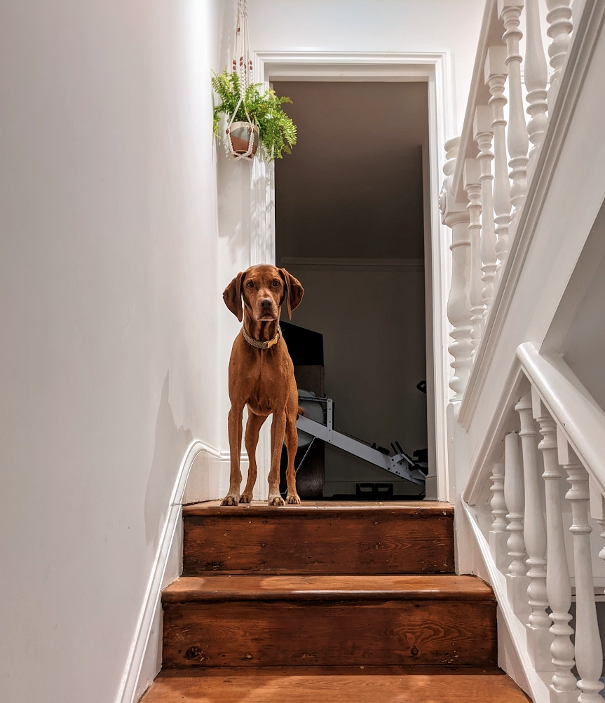

## This week in UCD Operations

This week is the end of our first sprint for UCD Operations. Our sprint goal was to:

> Set up the infrastructure for the correct storage of data

This week was 😸 because we managed to get a UCD Ops Sharepoint site created.

With the scope of UCD Operations being so vast, you may be asking yourself why? Why focus on this as your first sprint goal?

In Operations we believe that governance, data and knowledge management is the backbone of everything we do.

Also this week we have embedded our agile ways of working and evolved our service approach to how we deliver Operations.

Below are updates from each practice, if you get to the end, there’s a classic IT joke AND a gorgeous dog picture, just for you.

---

## Design - Tom Frankland

### What went well

* Starting my new role in design operations! 🎉
* Planning some discovery activities to focus on for the next 4-8 weeks
* Intros with Gareth and Stu - the latest designers to join Defra's design Community
* Adopting agile ways of working for the UCD operations team, including daily stand ups and sprints

### What didn’t go well

* It's my first week so... nothing! Hope it continues! 🙂🤞

---

## Content - Cerys Mainwaring

### What went well

* Setting up new users on SOP and completing leaver requests to help today up team structure  
* Onboarding - helping process new starter forms, liaising with recruitment and candidates and ordering IT equipment.
* Created a Content Community Distribution List -  DL-DEFRA-UCD Content Community - UCDContentCommunity@defra.gov.uk
* Note taking at a content research session, really interesting!

### What didn’t go well

* Delays on getting new starter laptops
* Some SOP set up issues for new users, dealing with SCCL.  
* OTL Timecard issue - needing clarification of BAU codes

---

## Research - Samantha Brown

### What went well

* Recruitment for the ivory ban service. Feedback from the researcher we supported was ‘It felt like I could focus on my research’
* Creation of a Sharepoint online
* Understanding and removing the barriers users face with off network devices and Sharepoint
* Talking with Lindsay Baker about the standards and guidance project

### What didn’t go well

* Management of data on Google Workspace
* It still feels like we are spinning plates with the amount of work we have to do

---

## If you need a smile

Don't use "beef stew" as a computer password. It's not stroganoff.

---

## Meet our colleagues' pets

This is Murray, he is owned by Dave Thomas (user research). He's 8 years old.

He's a Hungarian Vizsla aka the 'velcro dog'.  

Dave says ‘He is the most loving thing and never wants to leave your side’.
