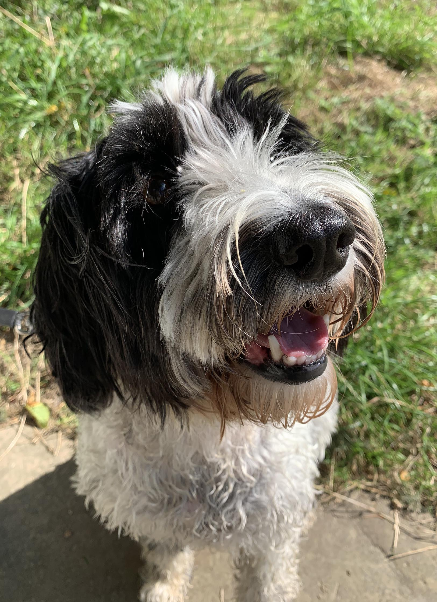

## This week in UCD Operations

This week is the start of our second sprint for UCD Operations.

This week we had two sprint goals:

This week is the start of our second sprint for UCD Operations. This week we had two sprint goals:

> Implementation and adoption for correct storage of data

and

> Start doing discovery interviews with designers

---

## Design - Tom Frankland

### What went well

* Became familiar with current onboarding process for new permanent designers and contractors
* Started putting together a discussion guide for some discovery interviews
* Put together a framework for a survey on tool use among designers (after learning how to use Qualtrics first!)
* Had multiple conversations with designers in and outside of Defra; there's lots to learn but it's great to feel I’m starting to build up a better understanding of design across government

### What didn’t go well

* Unfortunately the latest designer scheduled to join the team wasn’t able to start for when we planned, due to a delay to his checks that’s outside of our control
* It feels like it’s taking ages to get ready to go out and start talking to designers, but at the same time I’m learning how to do research properly, so worth the wait!

---

## Content - Cerys Mainwaring

### What went well

* Working through onboarding new starters has been going well and created a content team onboarding Trello board, with the help of Caroline and Hannah’s expertise!
* Security clearance for the team - thanks to all who have replied so far with the requested information

### What didn’t go well

* Am yet to secure a contact name for OTL timecard issues, but watch this space!

---

## Research - Samantha Brown

### What went well

* Starting the Research Ops strategy. Big shout out to Clare for sharing her ‘I need water’ research and test strategy. If you need strategy inspo Clares is the bee's knees 🐝
* Feedback from Suzanne Amos on using Defra’s remote tools. It has helped me to start thinking about the sprint 3 goal being around tools.
* Working with the knowledge management team on MyIT, we’ve found some super interesting data already which has made us question our research objective. Love it.
* The Ops team stepped in at the very last minute (literally 2 minutes before) to host a training session with Department for Transport colleagues on ethics. I really enjoyed the session, I feel like I learned a lot listening to different perspectives.
* Caroline Jarrett's session - Surveys that work: an introduction to the Survey Octopus and Total Survey Error. Fascinating, if you get the opportunity to listen or take part in one of Carolines sessions, grab it.

### What didn’t go well

* Ivory ban recruitment round 2. Despite chasing the recruiter we recieved the participant details too late Friday afternoon. It also didn’t go as smoothly as I would have liked on the day of the research.
* Sharepoint online training. The host did a good job but I found it hard to follow.
* Lockdown fatigue, I’m not sure if it was the weather but last week was a challenge. The sun’s shining now though and children are back at school soon 🙌

---

## If you need a smile

Happy News -  Stories to make you smile!

Yes this may be aimed at children, but it has one minute videos of weekly happy news with positive and uplifting stories that are guaranteed to boost your serotonin levels!

[Happy News: Stories to make you smile - CBBC Newsround](https://www.bbc.co.uk/newsround/50434875)

---

## Meet our colleagues' pets

This is Star ⭐  a 4 year-old Sproodle. She’s owned by Tom and is part of the UCD Ops team.

She loves sausage rolls, belly rubs and being the centre of attention, and is very good at ensuring she gets all three!
