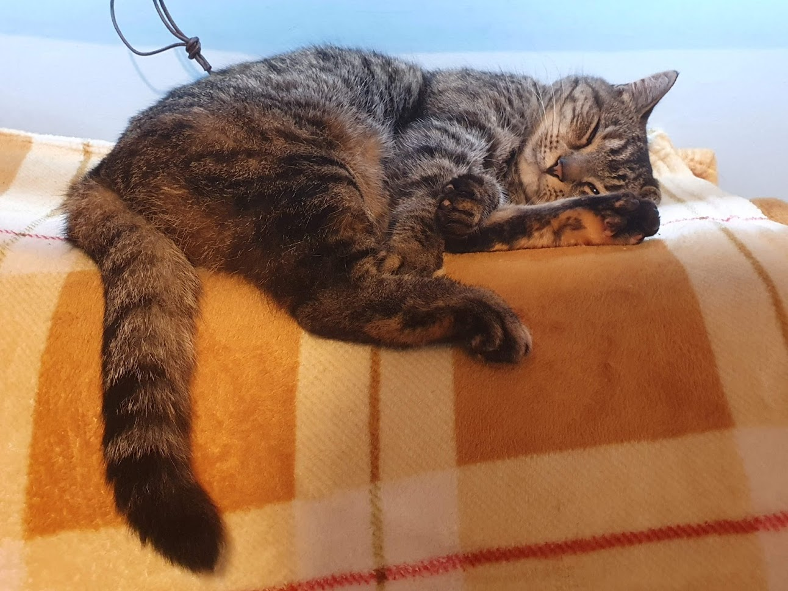

## This week in UCD Operations

This week is the end of our second sprint for UCD Operations.

This week we had two sprint goals:

This week is the start of our second sprint for UCD Operations. This week we had two sprint goals:

> Implementation and adoption for correct storage of data

and

> Start doing discovery interviews with designers

This week was 🙀 because we realised that our sprint goal was too big and vague. We have learnt that our sprint goals need to be specific and measurable. We also need to include a sprint goal of all the business as usual tasks that we are doing alongside our continuous improvement.

For our third sprint, our goals will be:

> 1. Focus on using Sharepoint online to:
>    * upload and share files
>    * prevent someone from accessing a file they shouldn’t

We believe sharepoint supports the research infrastructure, managing user-research insights and making insights accessible throughout Defra.

This will be confirmed when we have successfully shared a file from an off network device to an internal sharepoint site.

> 2. Our focus on supporting people in order to amplify the value of user centred design

We believe our support will give people the ability to focus their efforts on being user centred. This will be confirmed when we have at least five tickets in the completed column on our trello board at the end of the sprint.

> 3. Our focus on speaking to designers to:
>    * understand their role, their experience of designing at Defra and working in a community of designers
>    * understand usage of collaborative whiteboarding tools

We believe running discovery interviews and surveys with designers will identify opportunities to support them going forward.

This will be confirmed when we have successfully run a minimum of five discovery interviews and surveyed designers on their usage of collaborative whiteboarding tools.

Below are updates from each practice, when you get to the end, there’s something to make you smile and a gorgeous cat picture, just for you.

---

## Design - Tom Frankland

### What went well

* I really enjoyed our community of practice call with Hannah Baker, Hannah’s presentation was fantastic as usual and there were some great conversations after.
* I had a really positive catch up with Jeni Street about getting some cross discipline design crits going. Hopefully it'll turn into a really useful resource for the community
* I got a couple of surveys ready to go out to the design community, one in particular is around collaborative whiteboard tools that I’m really looking forward to sharing. Hopefully we can start building an understanding of which tool works best for designers working across Defra.
* I’ve finally found some time to start drafting a blog post with Robin on our UCD work in future farming. Robin is a brilliant writer and I’m feeling very grateful that he's helping out with it.
* I discovered cheese and marmite hot cross buns 😋

### What didn’t go well

* I’m struggling with the feeling that there’s always more I should be doing. Weeknotes are helpful though in forcing me to reflect on what I’ve achieved each week.
* I’ve had to put in some escalations with DDTS to get IT issues resolved for new starters. It’s frustrating to see how easily small things can block people from working.

---

## Content - Cerys Mainwaring

### What went well

* Learning! Lots of learning this week, such as SharePoint, Card sorting and Optimal Workshop masterclass with Clare and learning my job role.
* The UCD community - you are all such a lovely group of people! Everyone is so helpful, friendly and kind!
* The weather! The lovely spring weather definitely makes everything the outlook sunnier!

### What didn’t go well

* Some ongoing onboarding issues, such as staff numbers being issued late which makes kit ordering late!
* Finding out the cut off for the Financial Year End was a little earlier than I thought, so want to ensure new starters are on SOP asap to make sure everyone gets paid on time!

---

## Research - Samantha Brown

### What went well

* Conversation with D for E on the final plans for our X GOV Research Ops meetup. Super excited for this event, it's happening Monday 1st of March. Eeeek !
* How to: card sort. I’d love to have more ‘how to’s’. We have so much knowledge in the UCD community, it's joyous to hear people talking about what gets their inner geek going. Thank you to Clare for her time and knowledge on card sorting and Optimal Workshop.
* Setting up a call with NHS Digital on user panels - thank you to Natalie Barron for making this happen.
* Retro with Ricardo on the Defra experience. We used a bother scale and mapped out what enraged the beast so that we can improve the onboarding process.

### What didn’t go well

* I was sad to see Cecile leave Defra and Conor move into his next role. I hope that we see them both soon.
* Setting the sprint goal so vague - I am kicking myself over making the mistake. It's okay though as we’ve learnt and we will improve from it.
* It seems to be soooo very difficult to do the simple task of transferring a research video from a contractor's own device to a networked machine. Suzanne Amoshas been trying so hard to do this and has come up with a lengthy and time consuming work around. We’ve got to get better at this. I want to spend more time next week testing Sharepoint online to help resolve this issue.

---

## If you need a smile

What’s orange and sounds like a parrot?

A carrot!

---

## Meet our colleagues' pets

Clare says "This is Lady Smokey McFluffykins of the House Loveday. Our supreme feline overlord."
