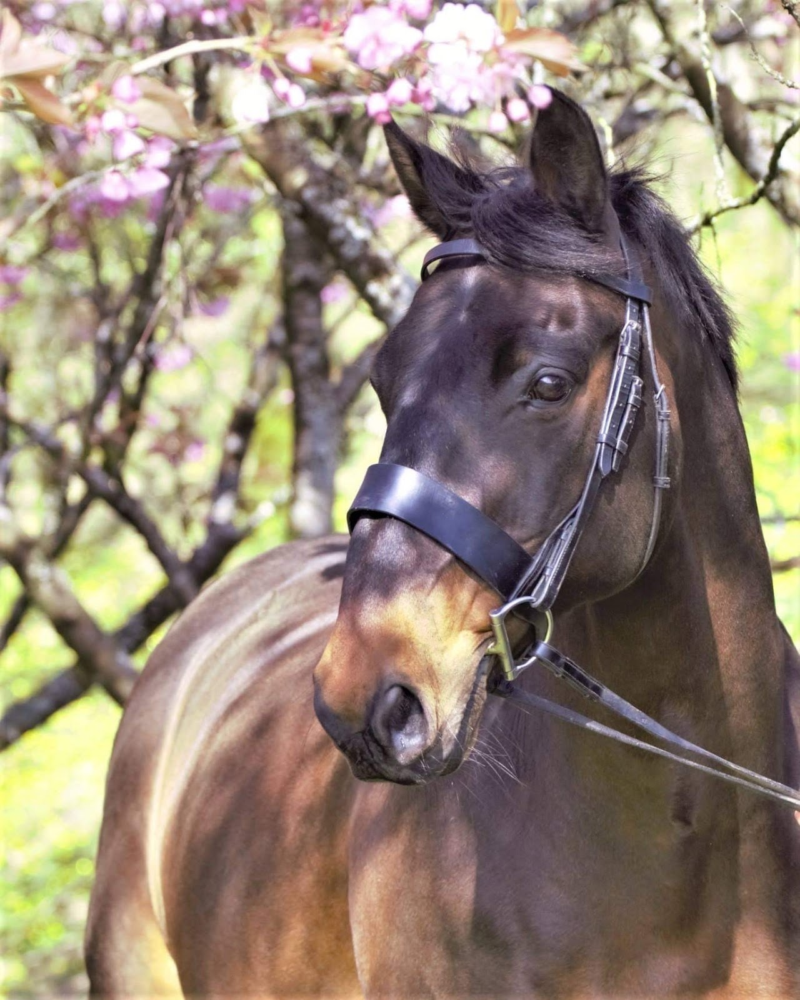

## This week in UCD Operations

This week is the start of our third sprint for UCD Operations. This week we had three sprint goals:

> 1. Focus on using Sharepoint online to:
>    * upload and share files
>    * prevent someone from accessing a file they shouldn’t

We believe sharepoint supports the research infrastructure, managing user-research insights and making insights accessible throughout Defra.

This will be confirmed when we have successfully shared a file from an off network device to an internal sharepoint site.

> 2. Our focus on supporting people in order to amplify the value of user centred design

We believe our support will give people the ability to focus their efforts on being user centred. This will be confirmed when we have at least five tickets in the completed column on our trello board at the end of the sprint.

> 3. Our focus on speaking to designers to:
>    * understand their role, their experience of designing at Defra and working in a community of designers
>    * understand usage of collaborative whiteboarding tools

We believe running discovery interviews and surveys with designers will identify opportunities to support them going forward.

This will be confirmed when we have successfully run a minimum of five discovery interviews and surveyed designers on their usage of collaborative whiteboarding tools.

Below are updates from each practice, when you get to the end, there’s something to make you smile and a gorgeous horse picture, just for you.

---

## Design - Tom Frankland

### What went well

* Had a great response to a survey exploring which whiteboarding tool is right for the designers at Defra, and have now fed this feedback back into the conversation around getting sign off for this software
* Finally finished prepping for my discovery interviews and have scheduled some for next week
* I attended the first research operations x-gov meetup, was great to see lots of engagement and it gave me lots of ideas for running a similar x-gov event for design ops  
* Joined some brilliant service week events, my favourite probably being a talk on design histories which has really reinvigorated my interest in this topic, hopefully we can get something like this up and running at Defra soon

### What didn’t go well

* I was introduced to the complexities of requesting new software this week, and it pretty much blew my mind! 🤯  I’m still hopeful we can push through and get some shared licences for a collaborative whiteboarding tool though, and understanding the process will ultimately be helpful for whenever we need to look at adopting other software in the future.
* Too much good services week content! There’s loads I never managed to get round to seeing this week, fortunately it seems a lot of the presentations [have been recorded](https://www.youtube.com/playlist?list=PLoe8p5EhqZ2I29ZOlnqGiNlgDzqWLwCpA) so I’ll be working my way through those over the coming weeks as well.

---

## Content - Cerys Mainwaring

### What went well

* Content Community Catch Up call this week went well and was lovely to virtually meet everyone! There were great presentations and interesting discussions. Thanks to all that took part with the Slido session - I will work through the word cloud we created and see what we can do to help with the issues raised.
* MOST of the new starter kits arrived in time and without delay…. Most as not all unfortunately....
* SharePoint session with Sam and Fern - this was a really useful session to remind me of how SharePoint works, as I am a bit rusty as I am familiar with the older version! So far we have found it works well for what we want it to do and I am excited to see what else we can learn it can help us with!
* OTL Timecards - I am very close in securing a Q&A session with a APHA colleague, we just need to finalise some dates but will let everyone know. There is no formal training unfortunately but she is happy to answer any questions. It is likely it will be April time as she is currently involved in Financial Year End, so watch this space for more information!

### What didn’t go well

* Some laptops sadly did not arrive on time - or the whole kit did not arrive. Very frustrating and I am almost certain MyIT will soon block my calls but I will keep trying to iron out these issues as I continue!
* Some seemingly recurring issues with transfers from other government departments resulting in payroll issues - I have started an issues log and will pick this up with the Recruitment Team and SSCL to see how we can improve on this in the future.

---

## Research - Samantha Brown

### What went well

* Sharepoint Online, Cerys and I had a focus session and successfully managed to complete a set of tasks. What I loved was that Sharepoint Online was very similar to the Google Workspace offering. You can work on a document and anyone else can see in real time what you're typing. None of this track changes on word documents or checking out files, that’s straight outta the 90’s!
* Working with Fern we also successfully used Sharepoint Online to upload a research video and then allow the research participant access to download their video. This takes away the need for file sharing such as we transfer which is not an approved tool.
* User panels, conversations across government. Thanks to Natalie Baron we have spoken with NHSBSA, NHS Digital, HMRC & the Heritage Fund. We are hearing lots of lessons learnt and tips on how to set up a user panel. Tips like ensuring your screeners include questions for upcoming research so you have them ready on your panel for researchers. Simple but brilliant.
* Cerys presentation to the content community. She smashed it and I loved reading through people's reactions and gratitude for all of the work that she does.
* Washing machines, feminists of UCD assemble! I successfully removed my old machine and plumbed in a new integrated washing machine all by myself (smugly drinks strong tea and eats a Yorkie) Hotpoint wanted £90 to fit a new one. Ninety quid! I am now considering a new career installing washing machines.

### What didn’t go well

* Collection of kit from leavers, still trying to get to the bottom of what went wrong!
* Recurring theme of new laptops arriving without chargers. How does this even happen? One of the benefits of our UCD Ops stand ups is that we talk about these blockers so we know it's not just happening in research, content or design. We are thinking about how to flag this.

---

## If you need a smile

I apologise in advance for this. It is my daughters favourite joke.

*My friend David lost his ID.*

*Now he’s just Dav.*

---

## Meet our colleagues' pets

This week, meet Cerys Mainwaring’s pride and joy  - Dudley!

Cerys says: "Dudley is a 21 year old Welsh Cob cross Hanovarian, who is completely spoiled! His favourite pastimes are eating, pretending to sleep when it’s time to ride, rolling in the muddiest patches he can find and spending all my money, but I wouldn’t change him for the world" 😃😃
