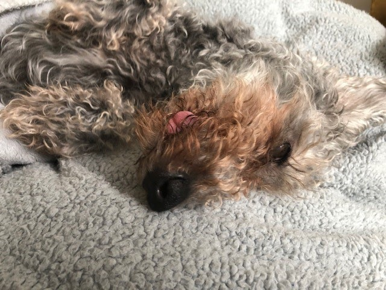
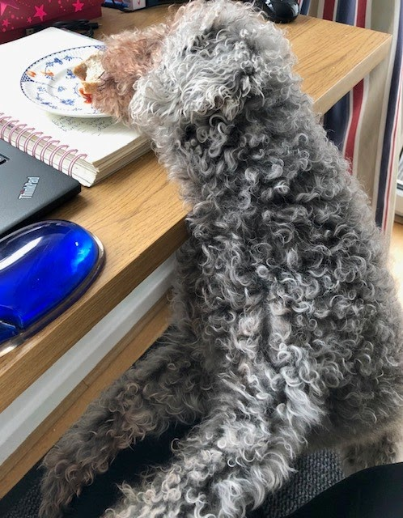

## This week in UCD Operations

As sprint 3 ends, this week was 😄 as we hit our sprint goals - YES !

Breaking our sprint goals down into small meaningful goals, i.e. one that we can read and is easy to understand without it being too prescriptive really helped us to focus on what we need to do.

For our sprint goals we used a format similar to user story templates:

> Our focus is on [Outcome]
>
> We believe it delivers [Impact] to [Customer]
>
> This will be confirmed when [Event happens]

We will continue to use this format for future sprints 😸

Firebreak - week commencing the 15th of March ops are having a firebreak week. Working at pace using agile methodologies is intense, nobody can sprint all of the time. We need time to pause and recharge, even more so during the Covid-19 pandemic.

We won't be having a break though - we are taking it as an opportunity to pursue other work that’s of interest, such as:
* Research Ops strategy
* User panels
* Clear ops debt such as emails
* Read through the outputs of the standards and guidance project
* Plan the UCD event in April

Below are updates from each practice, and when you get to the end, there’s a gorgeous cheeky dog picture.

---

## Design - Tom Frankland

### What went well

* We had a really interesting conversation with [Snook](https://wearesnook.com/) about some possible training around sustainability and climate - this is a topic that’s close to my heart and I’m really excited that we’re exploring this area, looking forward to future developments 💚
* I enjoyed this week’s UCD drop in, it was great to meet Paramita and talk about Design Ops, and to hear about some of the wider plans for the UCD team going forward.
* I completed my first two discovery interviews this week. It’s taken a while to get everything in place but really pleased with how these are going, looking forward to the next few coming up!

### What didn’t go well

* This week was a challenging one, as two service assessments I had agreed to help out with earlier in the year were both rescheduled for this week. This meant a lot of my time was spent preparing, assessing and writing reports.
* Losing my daily routine - due to the assessments I also lost out on my regular opportunity for a lunchtime walk or run. It was surprising how much of a difference this made to the rest of my day and even the day after, going to make sure I preserve the time for these going forward! 🚶‍♂️🌳

---

## Content - Cerys Mainwaring

### What went well

* The Financial Year End payroll cut off was earlier this week, but pleased to say that all our new starters are on the system. If you’re unsure if you are, please do let me know and we can check for you :)

### What didn’t go well

* Laptops arriving like London buses! Due to miscommunication with HR some of our new starters received more than one laptop! Apologies to those affected.
* Laptop leaver requests - after chasing IT on a few outstanding requests I found out there is a current delay in the process. if you are waiting on an old laptop to be collected, please be aware that there is a backlog at present, so any requests are taking longer than normal.

---

## Research - Samantha Brown

### What went well

* Identifying and agreeing that we need a firebreak week
* Hitting our sprint goal and finding a format that works for us
* Having the opportunity to take part in the senior research interviews
* Making progress with handling and storing our research data
* Receiving my end of year feedback. I cried happy tears !

### What didn’t go well

* Feeling like I’m behind in catching up with people and emails - I hope to catch up this week

---

## Meet our colleagues' pets

This is Tess, she is owned by Samantha and is part of the UCD ops team.

Tess is a 13 year old beddlington terrier, she’s been part of our family for just over a year. She came to us from the RSCPA and was part of a cruelty case. Despite being blind and deaf she’s living her best life with us. I’d like to say she enjoys long walks on the beach but really does prefer sleeping and eating (same!)

Don’t feel too sorry for her as I tried to take a photo for the weekly notes and she pinched my sausage sandwich. Jokes on her as it was a vegan one.

