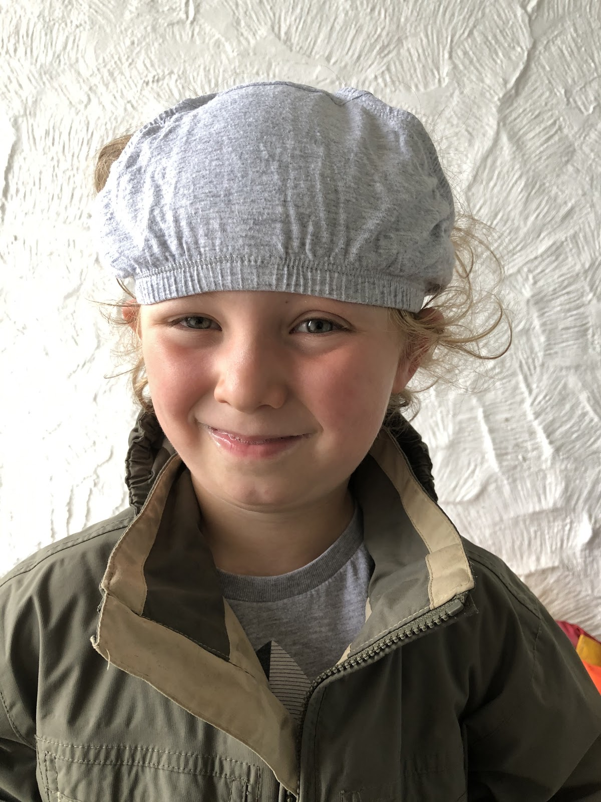

## This week in UCD Operations

🔥 End firebreak week one 🔥

We’ve really benefited from having a firebreak week, so much so that we have agreed to run it for two weeks rather than one.

No one can sprint all of the time and it is especially important during a pandemic to take time to breath. There is a poster in the flood digital room in Warrington that says:

> "Almost everything will work again if you unplug it for a few minutes, including you."
>
> \- Anne Lamott

We know it’s hard when you're delivering at pace to stop and slow work, in ops we believe it's important to do this as and when you can.

We haven’t had a week off though! We’ve taken the time to focus on all those little things that stack up after a while. Emails, training, check ins with colleagues, working on our strategy and drafting ‘how to’ guides.

Below are updates from each practice, and when you get to the end, there’s something to make you smile.

---

## Design - Tom Frankland

### What went well

* More interviews with designers, these have been going great and I’ve really enjoyed getting to know what the designers across Defra are up to and what we can do to support them
* Timeboxing - I’ve always kept a to do list but I’ve recently started scheduling these tasks on my calendar, influenced in part by recently reading [this article](https://www.nirandfar.com/todo-vs-schedule-builder/). I may not have got more done but I definitely felt like I’ve been more focused with my work this week. It also feels like this technique has the added benefit of ensuring some balance between your own work and responding to outside meeting requests, so it’s definitely one technique I’ll be trying to stick with! 🗓️

### What didn’t go well

* Sharepoint training - obviously not the most exciting of topics and this has taken up a significant chunk of my time this week. Of course there are benefits that will come from doing this, but it’s still frustrating to lose almost a day to training when there’s plenty of other things to be getting on with.
* Equipment returns - a source of pain for all the ops staff; I thought I’d try and simplify the process by offering any leavers the option of returning their equipment to their home office. Sadly it seems this is also trickier than it first appears, as tracking down someone who can receive this equipment is way harder than it should be!

---

## Content - Cerys Mainwaring

### What went well

* Managed to complete an online course this week which I had planned for ages and did not get around to finishing!
* Spent some time this week thinking about my main tasks in my role and our processes by getting them written down and standardised as desk instruction documents.  I am hoping this will help in the future as the team grows and new members join - plus gives me a chance to sense check how I have been doing certain tasks and if there is any way I can improve and make things as simple and straightforward as possible for all concerned! Any thoughts/ideas, please send them my way!

### What didn’t go well

* SOP… found an issue with my own SOP procurement system that hopefully I can get to the bottom of soon, but it certainly is frustrating! I sympathise with everyone who has any SOP woes!

---

## Research - Samantha Brown

### What went well

* Chocolate brownies - nom nom nom
* Sharepoint Online. BIG THANKS to Robin who gave some of his time Friday to help us test the permissions in the area we are planning to use for storing research data. We’ve made changes based on Robin's feedback and feel confident that it's heading in the right direction.
* Firebreak week - I was unsure about putting in a firebreak, having worked at pace for so long in flood it felt strange to pause. We have felt the benefit from it and it feels right to run it for the same length of time we run our sprints.
* User panels - thank you to FFC specifically Natalie and Fern. We are starting to shape the user panels now with draft personas and a user needs hierarchy.

### What didn’t go well

* Online learning - five hour course for success profiles.  The course had originally been a two day course and has been cut down to five hours. It just didn’t work. I ended up acting out the role of an interviewee three times.

---

## If you need a smile...

On one of our lockdown walks it was raining so I told my son to put something on his head to keep it dry. Yes. Those are (clean) underpants.
