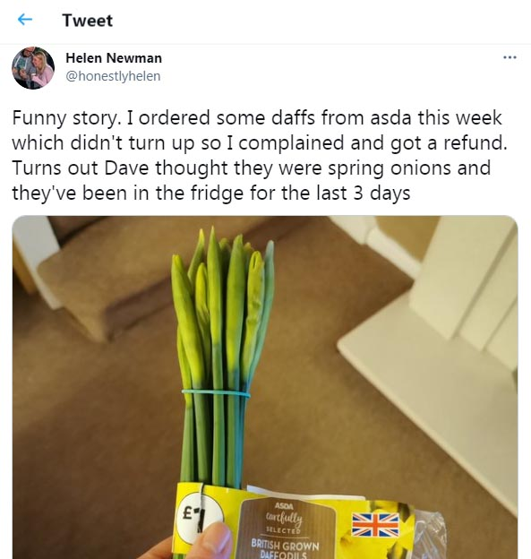
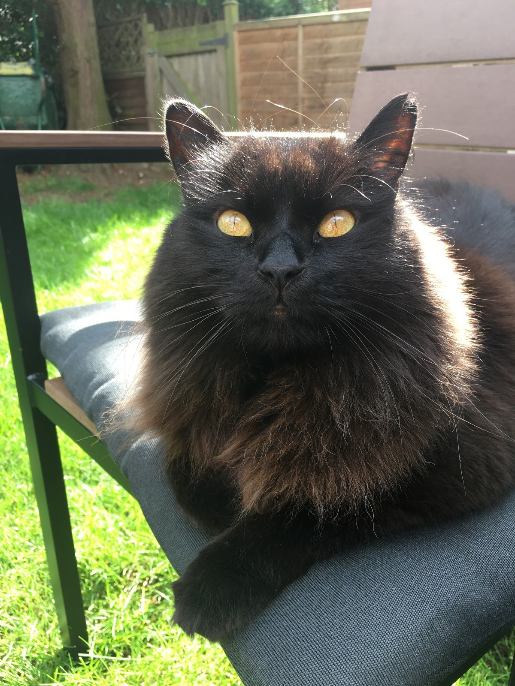
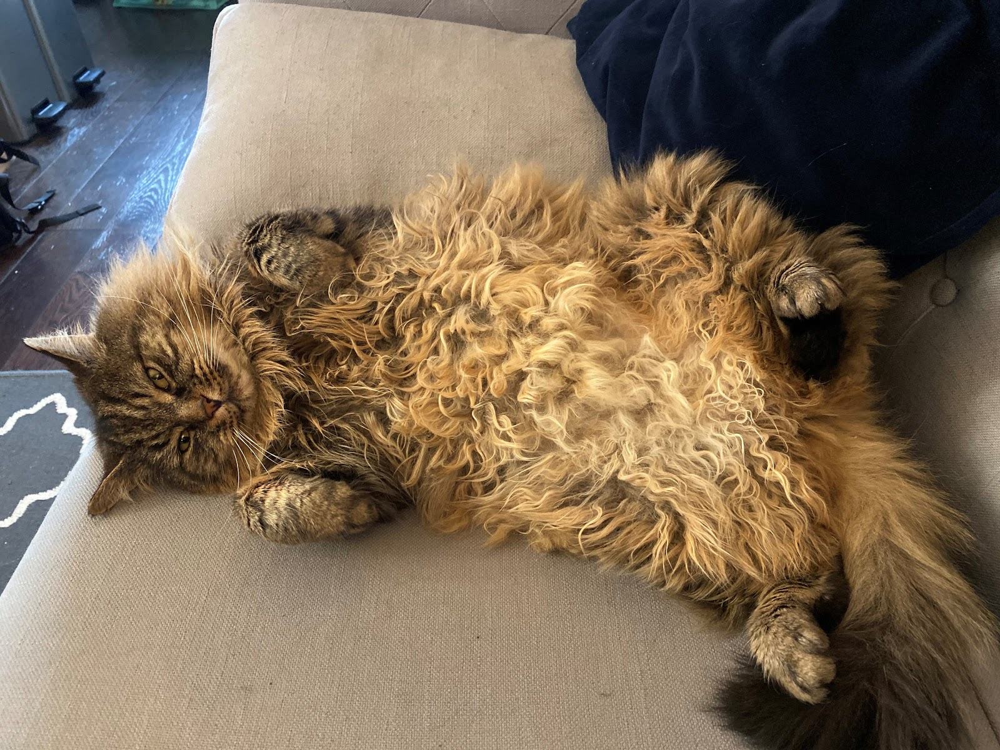
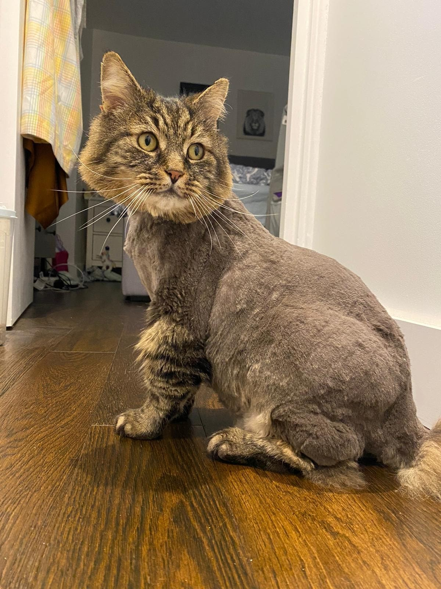

## This week in UCD Operations

🔥 End firebreak week two 🔥

As our two week firebreak ends, we have been looking forward to sprint 4.

We have agreed that our sprint goals will be:

> 1. Focus on rolling out Sharepoint Online:
>    * Identify perceived problems around the old version of Sharepoint
>    * Get an update on the O365 migration to Sharepoint Online for the Future Farming programme
>    * Talk with and reassure colleagues on how to use Sharepoint Online

We believe Sharepoint Online supports the UCD infrastructure, managing user-research insights and making insights accessible throughout Defra.

This sprint goal will be confirmed when we have successfully moved one more person fully over to Sharepoint Online for their data and knowledge management.

> 2. Focus on supporting people in order to amplify the value of user centred design
>    * Talk with colleagues in content to understand how we ensure that they are paid properly once they start at Defra.

We believe our support will give people the ability to focus their efforts on being a content specialist.

This sprint goal will be confirmed when we have identified how we stop delays to salary payments.

> 3. Our focus will be on planning the UCD meet up to:
>    * Make it a great day!
>    * Ensure that everyone who attends will get ideas and inspiration from speakers and attendees
>    * Allow sharing of what people are struggling with, talk about collaboration.

We believe starting to plan the day now we can have a really good day on April 22nd.

This sprint goal will be confirmed when we have the first draft of our agenda.

Below are updates from each practice, and when you get to the end, there’s something to make you smile.

---

## Design - Tom Frankland

### What went well

* Planning the next UCD meet-up, which is due to take place on the 22nd April. This time we’ve been given a theme “collaboration”, and it’s been exciting to think through the possibilities this gives us and how we can make this the best meet up to date
* I’ve had some really interesting conversations around GDS assessments this week, it's great to be able to advise others based on my own recent experiences as a design assessor and instil a bit of confidence in a process that can understandably feel  daunting to go through
* Our fantastic community of practice session this week, featuring two fantastic talks on plant health and exports 🪴🌳
* Finishing up my first round of conversations with designers. Looking forward a second round of interviews when I get back from annual leave in a couple of weeks time.

### What didn’t go well

* It feels like there’s some confusion about what tools we should be using or are allowed to use across DDTS. At the moment we haven’t heard anything that would suggest anyone needs to immediately change the way they’re currently working, but we'll obviously keep an eye on this and support any changes if and when they do happen.

---

## Content - Cerys Mainwaring

### What went well

* Had a short working week last week with some annual leave booked - it was nice to take some time off to relax with my family and my horse :)
* Had a great discussion on SharePoint with Sam and Suzanne Amos with some really useful testing of how we can store numerous files, locking down access and some troubleshooting issues - watch this space for further information coming very soon!
* Getting some desk instructions of our processes down on paper and testing them - always good to sense check what we do and if there is a way to improve, we are all about continuous improvement in the UCD Ops team!

### What didn’t go well

* Feeling like I didn’t have enough time to finish some of the smaller tasksI wanted to do before going on leave - but tomorrow is always another day :)

---

## Research - Samantha Brown

### What went well

* Chat with Department of Education research ops, they are going to share their new consent form. It's BEAUTIFUL and because I am a geek this makes me super excited. Thank you to the D for E legend Lucy Sutton for this 🙌
* There is talk of a single consent form across Government, which I can see both pro’s and con’s to. It would be great for participants.
* Two and a half days leave, though I need to get better at switching off.
* Co design working sessions on user panels, I have learnt a lot about co design and service design.
* I purchased 25 Camtasia and Snagit licenses for the UR team using my Government Procurement Card. Slightly nerve wracking using it for that much.  Camtasia is a screen recorder and video editor that will allow researchers to more easily record and edit remote and in-person usability tests.  Snagit allows for rapid screen capture and recording, annotation and sharing. Please do give me a shout if you need a licence.

### What didn’t go well

* Nothing!

---

## If you need a smile...

---

## Meet our colleagues' pets

Meet the purr-fect Moose and Ernie, who belong to Lucy Hartley.  Lucy says “I have two cats Ernie (the black one) who is 11 years old and Moose (the stripey one) who is 6 years old. They're both rescue cats from Archway. Ernie loves sleeping on the bath mat and eating cheese. Moose loves sunbathing and having his chin tickled. They're not the best of friends, they tend to bite each other on the bum every other day!” We particularly love the before and after photos of Moose’s lockdown haircut!

