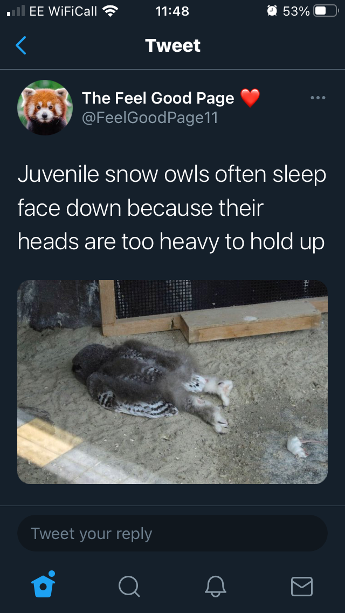

## This week in UCD Operations

As sprint 4 ends, this week was 😐 as we only hit some of our sprint goals, but then it was also 😄 as we had Daniel Owens with us for a few days.

We have struggled to get some of our sprint goals completed as lots of people we needed to speak with are off having a well earned rest 🏖️ We also lost a few days with the Easter bank holidays.

For sprint 5 we have agreed to carry forward some goals from sprint 4:

> 1. Focus on rolling out Sharepoint Online:
>    * Identify perceived problems around the old version of Sharepoint
>    * Get an update on the O365 migration to Sharepoint Online for the Future Farming programme
>    * Talk with and reassure colleagues on how to use Sharepoint Online

We believe Sharepoint Online supports the UCD infrastructure, managing user-research insights and making insights accessible throughout Defra.

This sprint goal will be confirmed when we have successfully moved one more person fully over to Sharepoint Online for their data and knowledge management.

> 2. Focus on supporting people in order to amplify the value of user centred design
>    * Talk with colleagues in content to understand how we ensure that they are paid properly once they start at Defra.  
>
> *This has been started and will be ongoing. So far we have had a great insight from colleagues coming from other government departments and their experiences. Going forward it allows us to monitor how things are progressing and ensure a smoother process for the new starter and vacancy manager*

We believe our support will give people the ability to focus their efforts on being a content specialist.

This sprint goal will be confirmed when we have identified how we stop delays to salary payments.

> 3. Our focus will be on planning the UCD meet up to:
>    * Make it a great day!
>    * Ensure that everyone who attends will get ideas and inspiration from speakers and attendees
>    * Allow sharing of what people are struggling with, talk about collaboration.

We believe starting to plan the day now we can have a really good day on April 22nd.

This sprint goal will be confirmed when we have the first draft of our agenda.

Daniel will lead on this from now on working with Cerys.

---

## Fast streamer - Daniel Owens

### What went well

* This week I worked with the UCD Ops team. What went well was the fact that I had a chance to interact with the team itself along with lots of other people across UCD to get a better understanding of how everything worked.

### What didn’t go well

* Some teething issues with IT access but most of these were resolved quickly.

---

## Content - Cerys Mainwaring

### What went well

* Having Daniel as part of the team this week has been great as he came with a wealth of experience and knowledge! 😃
* Dealing with some issues that I had faced before made processes much quicker and slicker and then resolving issues! This covered a number of aspects, but in particular some useful onboarding tasks, such as adding the new starter’s P45 straight onto SOP instead of waiting for HR to make contact, this will make a big difference in tax code issues, such as new starters having emergency tax on their first pay. A small but important step to be added on to my onboarding from now on!

### What didn’t go well

* Some ongoing SOP issues - I may as well leave this on here every week!
* SharePoint site - our new site is coming along well but I thought I had figured out restricting access to certain files and folders, but it has become a lot more confusing than I first thought! Guidance received from the 0365 team and will look at it next week with fresh eyes to resolve!
* The four day weekend coming back to a four day week - this is a positive of course as well as a negative as I felt that this week flew by and I ran out of time to do things!

---

## Research - Samantha Brown

### What went well

* User research Community of Practice call on Thursday afternoon, it was glorious. We didn’t have a set agenda and instead had a good catch up. I really enjoyed hearing about people's travel plans for post Covid and a good old catch up.
* Having Daniel in ops for a week, I wish we could keep him for longer!

### What didn’t go well

* User panel privacy notice - we were soooo close to having it signed off and ready, only to be told that we needed to complete a data protection impact assessment. I am frustrated at both myself and the process.

---

## If you need a smile...

A fun, albeit random, animal fact for the week! Highly recommend this Twitter feed to make you smile!

